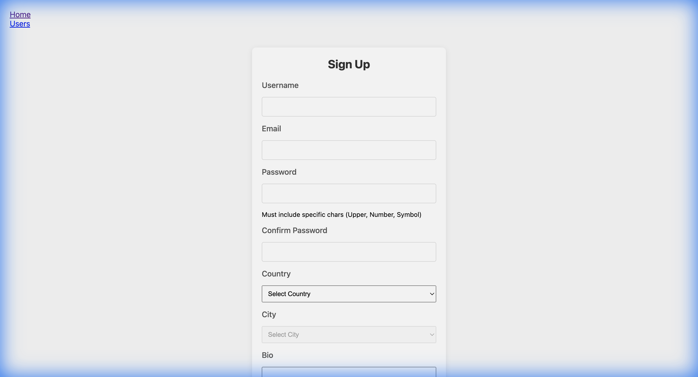
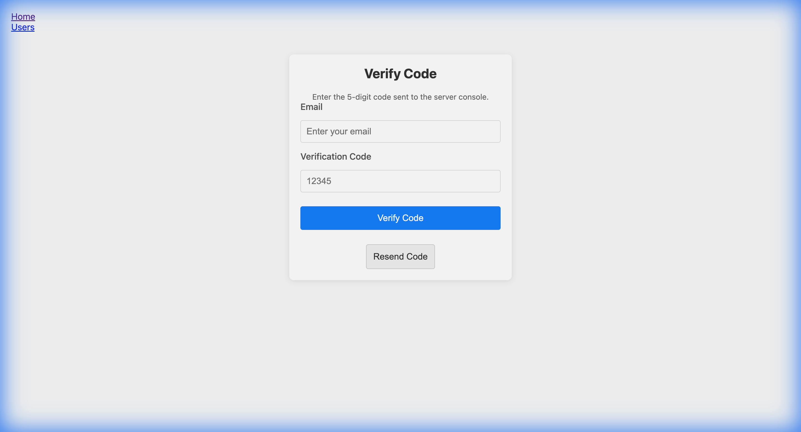
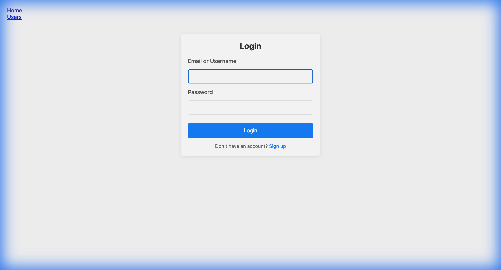

# Pull Request Descriptions

This document outlines the changes and verification steps for the three atomic Pull Requests aimed at restoring the authentication features.

---

## PR 1: User Signup Implementation
**Branch:** `feature/auth-signup`  
**Base:** `develop`

### 📝 Description
This PR implements the core user signup functionality, including the User model, signup API endpoint, and the frontend signup page.

### ✨ Key Features
- **Backend:**
  - `User` model with schema validation (username, email, password complexity).
  - `signup` controller function in `server/src/controllers/user.js`.
  - `/api/users/signup` route.
  - Generates a random 5-digit verification code (expires in 15 mins).
- **Frontend:**
  - `Signup.jsx` page with form validation.
  - Integration with `AuthContext` (signup function).
  - Route: `/signup`.

### 📸 Screenshot

---

## PR 2: Email Verification & Logic
**Branch:** `feature/auth-verification`  
**Base:** `feature/auth-signup`

### 📝 Description
This PR adds the email verification step, ensuring that users must verify their email address before logging in.

### ✨ Key Features
- **Backend:**
  - `verifyCode` controller function: Validates code and expiration.
  - `resendCode` controller function: Handles rate limiting and 15-minute wait time.
  - `getVerificationStatus`: Support for countdown timer.
  - Routes: `/verify-code`, `/resend-code`, `/verification-status`.
- **Frontend:**
  - `VerifyCode.jsx` page: Input for email and 5-digit code.
  - Automatic countdown timer for code expiration.
  - Route: `/verify-code`.

### 📸 Screenshot

---

## PR 3: User Login & Session Management
**Branch:** `feature/auth-login`  
**Base:** `feature/auth-verification`

### 📝 Description
This PR completes the authentication flow by adding login and logout functionality.

### ✨ Key Features
- **Backend:**
  - `login` controller: Validates credentials and checks `isVerified` status.
  - `logout` controller: Clears the auth cookie.
  - `getMe` controller: Retrieves current user session.
  - Routes: `/login`, `/logout`, `/me`.
- **Frontend:**
  - `Login.jsx` page.
  - `AuthContext`: Full integration of `login`, `logout`, and session persistence (`fetchMe`).
  - Route: `/login`.

### 📸 Screenshot

